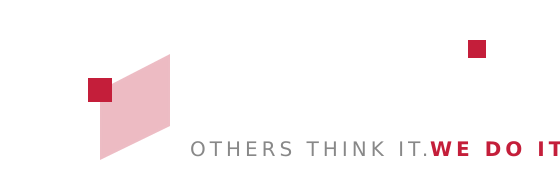

  

# APP-FORGE

**Automated Software Packaging for baramundi Management Suite**

---

## 🎯 The Story

As a baramundi partner without an MSW license (Managed Software), I faced the challenge of efficiently automating software packaging. Many baramundi customers worldwide know this problem - they use baramundi but cannot afford MSW, or they want to supplement their existing MSW installation with additional software.

**APP-FORGE bridges this gap.**

Developed by DADOiT, APP-FORGE automates the entire software lifecycle: from download to packaging, testing, and production release.

---

## ✨ What APP-FORGE Can Do

| Feature | Description |
|---------|-------------|
| **GitHub Releases** | Automatic download of new versions from GitHub |
| **Direct Downloads** | Support for direct download URLs |
| **Watcher/API Integration** | Folder monitoring for external sources |
| **Automatic Reports** | HTML reports with overview of all changes |
| **Email Notifications** | Automatic delivery when new versions arrive |
| **Test Workflow** | ASSIGNED → PASSED/FAILED workflow with baramundi Jobs |
| **Production Audit** | Controlled release to production environment |

---

## 📦 Editions

| Feature | Community | Professional | Enterprise |
|---------|:---------:|:------------:|:----------:|
| GitHub Downloads | ✅ | ✅ | ✅ |
| Direct Downloads | ✅ | ✅ | ✅ |
| Watcher Integration | ✅ | ✅ | ✅ |
| HTML Reports | ✅ | ✅ | ✅ |
| Corporate Identity | Optional | Optional | **Required** |
| Email Reports | ❌ | Optional | **Required** |
| Production Jobs | ❌ | Optional | **Required** |

**Community** - Perfect for getting started: Download, Deploy, Report  
**Professional** - Full flexibility with optional enterprise features  
**Enterprise** - Complete automation with validation

---

## 📋 Requirements

| Component | Requirement |
|-----------|-------------|
| **baramundi Management Suite** | Version **2024 R1** or newer |
| **bConnect API** | v1.1 + v2.0 enabled |
| **PowerShell** | 5.1 and 7.x |
| **.NET Runtime** | Installed with Setup |

---

## 🚀 Installation

1. Download `APP-FORGE-SETUP.exe`
2. Run the setup
3. Follow the configuration wizard
4. Done!

---

## 📜 License

APP-FORGE is available **free of charge**.

A free license is required for usage. You can obtain one automatically by creating an issue in our [License Repository](https://github.com/DADO-iT/APP-FORGE-LICENSES).

Why? We want to know who uses APP-FORGE so we can continuously improve the software and stay connected with the community.

---

## 📞 Contact

**DADOiT**  
Website: [dadoit.net](https://dadoit.net)  
Email: dadoit@dadoit.net

---

## 🇩🇪 Deutsche Version

[📖 README_DE.md (Deutsch)](README_DE.md)

---

*Developed with ❤️ by DADOiT for the baramundi Community*
